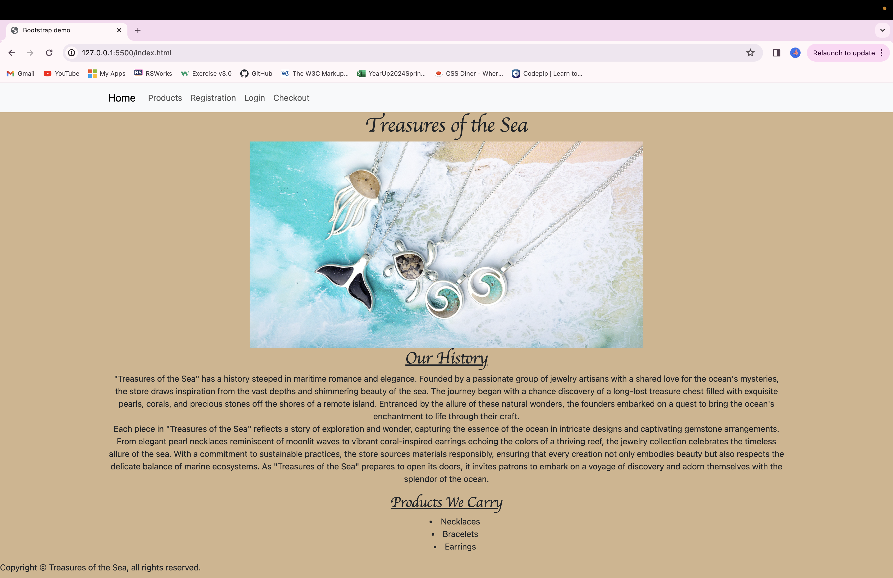
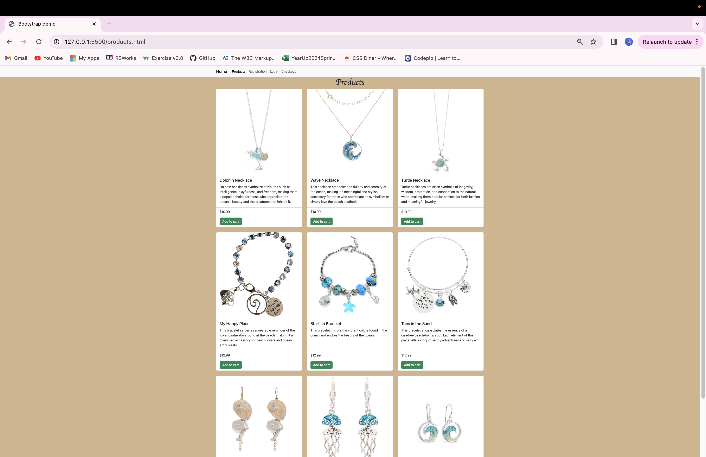
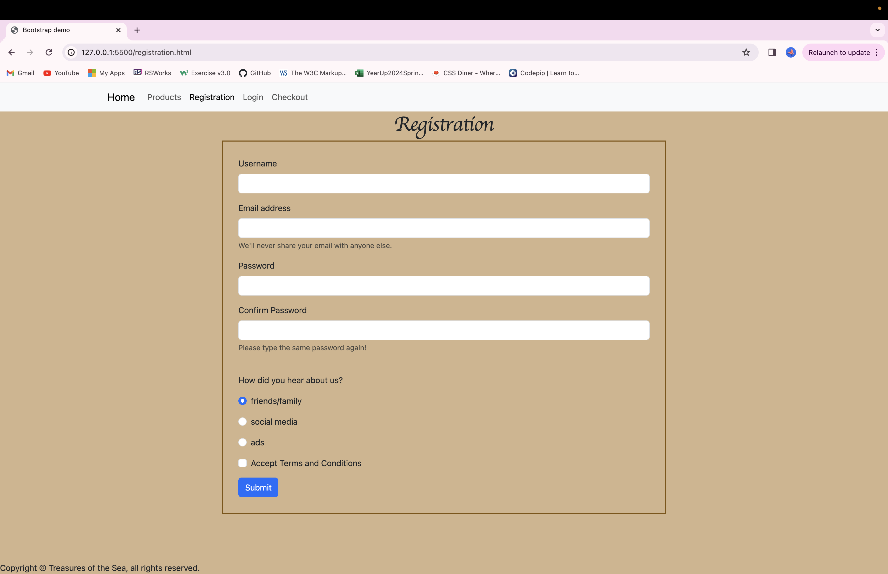
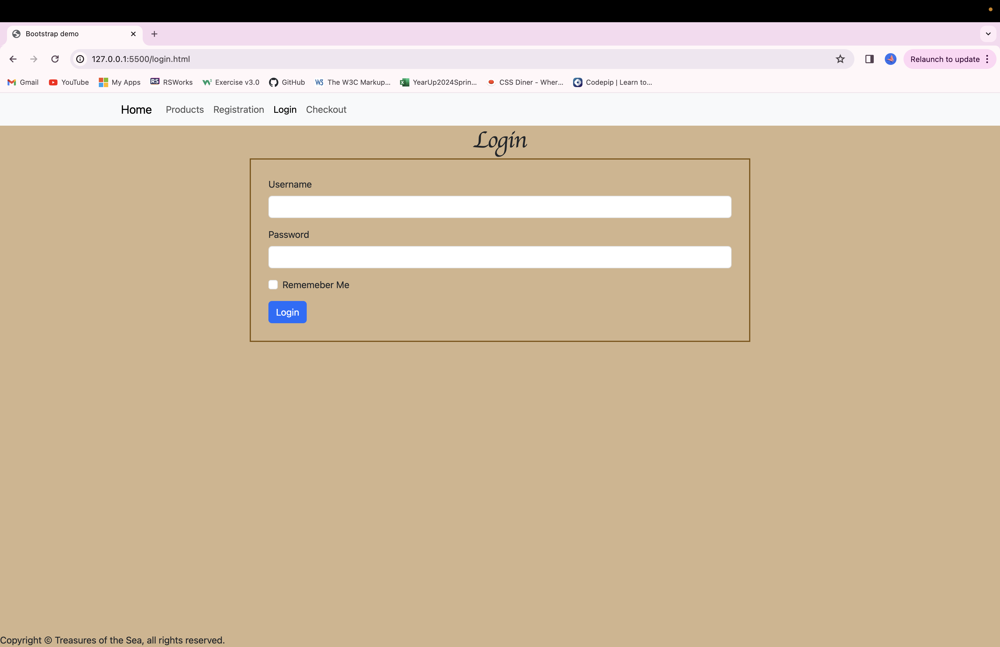
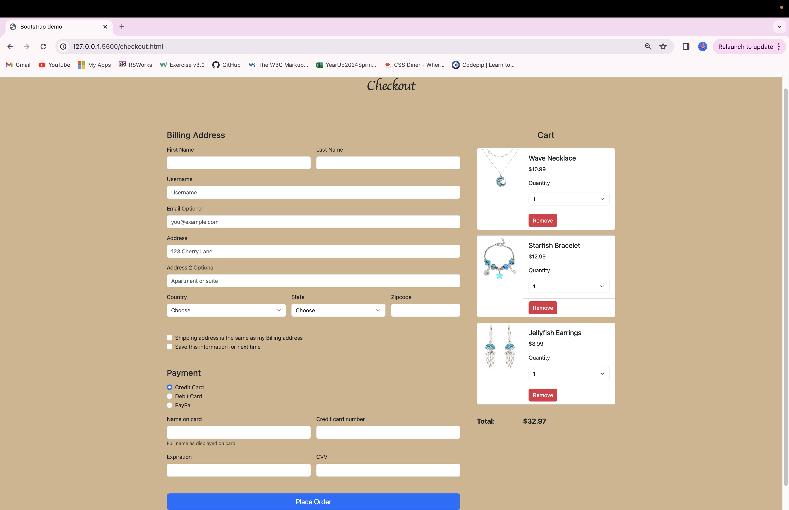

# Treasures of the Sea

## Overall description of project

For my project I used HTML, CSS, and Bootstrap to create an e-commerce website to sell jewelry products.I have five different
pages throughout my website. The layout provides a simple and easy experience for users to purchase their items.

1. Home Page: My home page includes the name of the jewelry store which is "Treasures of the Sea". It is followed by an image
that shows the beauty of our products along the blue waters of the ocean. I also added two paragraphs of the stores history which talks about how the idea of the jewelry was presented and the reason behind our craft. At the end I included a short bulleted list 
of the three products we carry, which are neclaces, bracelets, and earrings.

2. Products Page: The products page consistes of 9 items that I used the Bootstrap card component. It consists of three necklaces, three bracelets, and three pairs of earrings. 

3. Registration Page: This is for users to sign up to create an account with us. It asks to create an username, your email address, a password, and to select how you heard about the store. You also have to select the checkbox to accept the terms and conditions. Some elements that were used to create this form were input, label, and button elements.

4. Login Page: This page is for users to login their account that have already made one. You have to use the username and password you created. It also asks if you want to save the information so you don't have to type it out next time. Some elements that were used to create this form were input, label, and button elements.

5. Checkout Page: The last page is the checkout page which lets the user put in their billing address and shows what they have in their cart. For the cart portion , I used the Bootstrap card componenet for the layout. This allowed me to include the picture of the item and a remove button. For the address portion I added a select function so users can choose which country and state they are located in. It also has a section for the payment information then they can proceed to place their order. 

## Images of the sites's pages 

## Describe one piece of code 

One part of my project that I found interesting was creating the products page. I tried out different versions of the bootstrap card component and picked one that best suited my website.  Following the guideline of code for the grid card on Bootstrap, I made changes so it can fit my products. I knew before that I wanted three rows of three columns since I have nine products. With this in mind I made a div element with a class attribute , and gave that a value of "row row cols-1 row-cols-md-3 g-4". This allowed for there to be three rows of three from the medium breakpoint and up. For users on a phone or something similar the products would be displayed one card per row so they can see a clear description of each item. The card component doesn't include a add to cart button which means I had to add one without interfering with the rest of the code. After some researching, I added a card footer attribute to a new div element right under the previous one. Inside this card footer I added the elements and attributes needed to create the add to cart button. Throughout this process I realized that it takes quite a lot of playing around with the different elements to make the outcome you desire. 